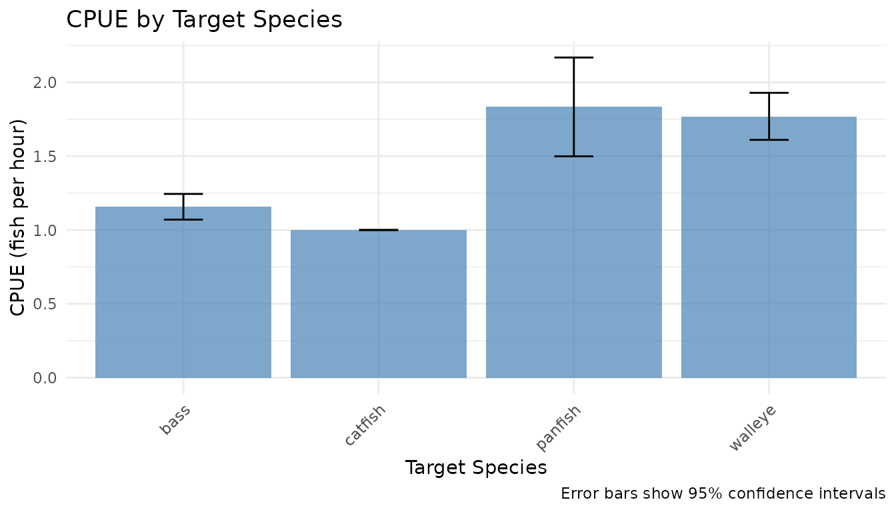
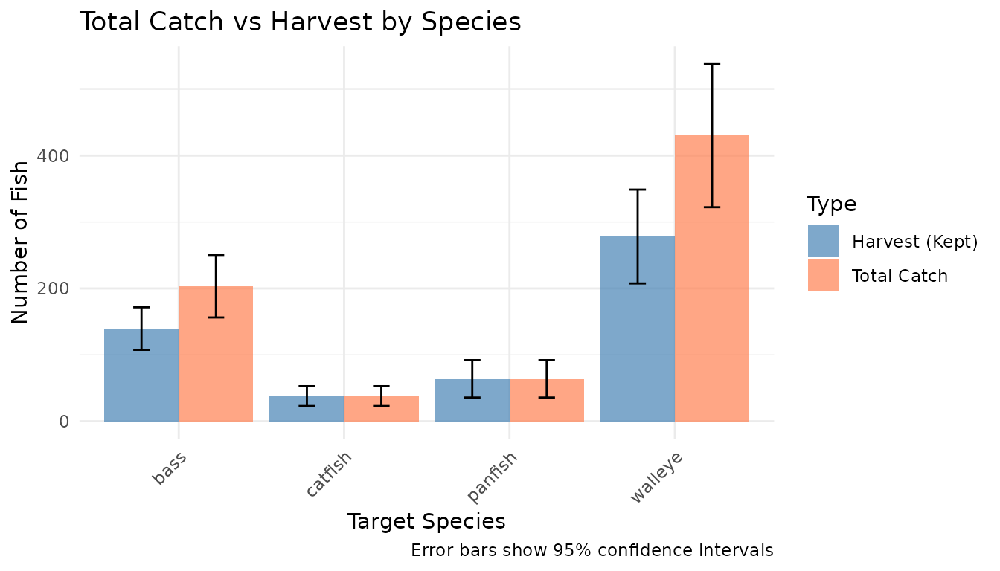

# CPUE and Catch Estimation

``` r
library(tidycreel)
library(survey)
library(dplyr)
library(ggplot2)
```

## Introduction

This vignette demonstrates how to estimate Catch Per Unit Effort (CPUE)
and total catch/harvest using tidycreel’s survey-first approach. All
estimators build on the `survey` package for proper design-based
inference.

## Key Concepts

### CPUE Estimation Modes

tidycreel provides two CPUE estimation modes:

1.  **Ratio-of-means** (default): Total catch ÷ total effort
    - Preferred for incomplete trips or when trip completion varies
    - Uses
      [`survey::svyratio()`](https://rdrr.io/pkg/survey/man/svyratio.html)
      for proper variance
    - More robust to outliers
2.  **Mean-of-ratios**: Mean of (catch ÷ effort) per angler
    - Appropriate for complete trips only
    - Uses
      [`survey::svymean()`](https://rdrr.io/pkg/survey/man/surveysummary.html)
      on pre-computed ratios
    - Can be sensitive to zero-effort trips

### Catch/Harvest Estimation

Total catch or harvest uses
[`survey::svytotal()`](https://rdrr.io/pkg/survey/man/surveysummary.html)
to expand interview data to population totals with proper variance
estimation.

## Loading Example Data

``` r
# Load toy datasets
interviews <- readr::read_csv(
  system.file("extdata/toy_interviews.csv", package = "tidycreel"),
  show_col_types = FALSE
)
calendar <- readr::read_csv(
  system.file("extdata/toy_calendar.csv", package = "tidycreel"),
  show_col_types = FALSE
)

# Preview interview data
head(interviews)
#> # A tibble: 6 × 17
#>   interview_id date       time_start          time_end            location mode 
#>   <chr>        <date>     <dttm>              <dttm>              <chr>    <chr>
#> 1 INT001       2024-01-01 2024-01-01 08:30:00 2024-01-01 08:45:00 Lake_A   boat 
#> 2 INT001B      2024-01-01 2024-01-01 08:30:00 2024-01-01 08:45:00 Lake_B   boat 
#> 3 INT002       2024-01-01 2024-01-01 09:15:00 2024-01-01 09:30:00 Lake_A   bank 
#> 4 INT002B      2024-01-01 2024-01-01 09:15:00 2024-01-01 09:30:00 Lake_B   bank 
#> 5 INT003       2024-01-01 2024-01-01 10:00:00 2024-01-01 10:20:00 Lake_A   boat 
#> 6 INT003B      2024-01-01 2024-01-01 10:00:00 2024-01-01 10:20:00 Lake_B   boat 
#> # ℹ 11 more variables: shift_block <chr>, day_type <chr>, party_size <dbl>,
#> #   hours_fished <dbl>, target_species <chr>, catch_total <dbl>,
#> #   catch_kept <dbl>, catch_released <dbl>, weight_total <dbl>,
#> #   trip_complete <lgl>, effort_expansion <dbl>
```

## Creating Survey Designs

### Day-Level Design

First, create a day-level design from the sampling calendar:

``` r
# Create day-level survey design
svy_day <- as_day_svydesign(
  calendar,
  day_id = "date",
  strata_vars = c("day_type", "month")
)

# Check the design
summary(weights(svy_day))
#>    Min. 1st Qu.  Median    Mean 3rd Qu.    Max. 
#>   1.027   1.027   1.064   1.052   1.064   1.064
```

### Interview-Level Design

For CPUE and catch estimation, we need an interview-level design. Join
day-level weights to interviews:

``` r
# Join day weights to interviews
interviews_weighted <- interviews %>%
  left_join(
    svy_day$variables %>% select(date, .w),
    by = "date"
  )

# Create interview-level survey design
svy_interview <- survey::svydesign(
  ids = ~1,
  weights = ~.w,
  data = interviews_weighted
)

# Check the design
summary(weights(svy_interview))
#>    Min. 1st Qu.  Median    Mean 3rd Qu.    Max. 
#>   1.027   1.064   1.064   1.055   1.064   1.064
```

## CPUE Estimation

### Ratio-of-Means (Default)

The ratio-of-means approach is preferred for most creel surveys:

``` r
# CPUE by target species (ratio-of-means)
cpue_species <- est_cpue(
  svy_interview,
  by = c("target_species"),
  response = "catch_total",
  effort = "hours_fished",
  mode = "ratio_of_means"
)

cpue_species
#> # A tibble: 4 × 10
#>   target_species estimate     se ci_low ci_high  deff     n method   diagnostics
#>   <chr>             <dbl>  <dbl>  <dbl>   <dbl> <dbl> <int> <chr>    <list>     
#> 1 bass               1.16 0.0443   1.07    1.24    NA    60 cpue_ra… <list [1]> 
#> 2 catfish            1    0        1       1       NA    24 cpue_ra… <list [1]> 
#> 3 panfish            1.83 0.171    1.50    2.17    NA    24 cpue_ra… <list [1]> 
#> 4 walleye            1.77 0.0812   1.61    1.93    NA    48 cpue_ra… <list [1]> 
#> # ℹ 1 more variable: variance_info <list>
```

This estimates CPUE as:

$$\text{CPUE} = \frac{\sum w_{i} \cdot \text{catch}_{i}}{\sum w_{i} \cdot \text{effort}_{i}}$$

where $w_{i}$ are the survey weights.

### Mean-of-Ratios

For complete trips, you can use mean-of-ratios:

``` r
# Filter to complete trips only
complete_trips <- interviews_weighted %>%
  filter(trip_complete == TRUE)

svy_complete <- survey::svydesign(
  ids = ~1,
  weights = ~.w,
  data = complete_trips
)

# CPUE by species (mean-of-ratios)
cpue_mor <- est_cpue(
  svy_complete,
  by = c("target_species"),
  response = "catch_total",
  effort = "hours_fished",
  mode = "mean_of_ratios"
)

cpue_mor
#> # A tibble: 4 × 10
#>   target_species estimate     se ci_low ci_high  deff     n method   diagnostics
#>   <chr>             <dbl>  <dbl>  <dbl>   <dbl> <dbl> <int> <chr>    <list>     
#> 1 bass               1.16 0.0443   1.07    1.24    NA    60 cpue_me… <list [1]> 
#> 2 catfish            1    0        1       1       NA    24 cpue_me… <list [1]> 
#> 3 panfish            1.83 0.171    1.50    2.17    NA    24 cpue_me… <list [1]> 
#> 4 walleye            1.77 0.0812   1.61    1.93    NA    48 cpue_me… <list [1]> 
#> # ℹ 1 more variable: variance_info <list>
```

This estimates CPUE as:

$$\text{CPUE} = \frac{1}{n}\sum w_{i} \cdot \frac{\text{catch}_{i}}{\text{effort}_{i}}$$

### Comparing Methods

``` r
# Compare the two methods
comparison <- bind_rows(
  cpue_species %>% mutate(method = "ratio_of_means"),
  cpue_mor %>% mutate(method = "mean_of_ratios")
) %>%
  select(target_species, method, estimate, se, ci_low, ci_high)

comparison
#> # A tibble: 8 × 6
#>   target_species method         estimate     se ci_low ci_high
#>   <chr>          <chr>             <dbl>  <dbl>  <dbl>   <dbl>
#> 1 bass           ratio_of_means     1.16 0.0443   1.07    1.24
#> 2 catfish        ratio_of_means     1    0        1       1   
#> 3 panfish        ratio_of_means     1.83 0.171    1.50    2.17
#> 4 walleye        ratio_of_means     1.77 0.0812   1.61    1.93
#> 5 bass           mean_of_ratios     1.16 0.0443   1.07    1.24
#> 6 catfish        mean_of_ratios     1    0        1       1   
#> 7 panfish        mean_of_ratios     1.83 0.171    1.50    2.17
#> 8 walleye        mean_of_ratios     1.77 0.0812   1.61    1.93
```

### CPUE by Multiple Groups

You can stratify CPUE by multiple variables:

``` r
# CPUE by species and mode
cpue_mode <- est_cpue(
  svy_interview,
  by = c("target_species", "mode"),
  response = "catch_total",
  effort = "hours_fished",
  mode = "ratio_of_means"
)

cpue_mode
#> # A tibble: 6 × 11
#>   target_species mode  estimate     se ci_low ci_high  deff     n method        
#>   <chr>          <chr>    <dbl>  <dbl>  <dbl>   <dbl> <dbl> <int> <chr>         
#> 1 bass           bank     0.667 0       0.667   0.667    NA    12 cpue_ratio_of…
#> 2 catfish        bank     1     0       1       1        NA    12 cpue_ratio_of…
#> 3 panfish        bank     1.83  0.171   1.50    2.17     NA    24 cpue_ratio_of…
#> 4 bass           boat     1.28  0.0383  1.21    1.36     NA    48 cpue_ratio_of…
#> 5 catfish        boat     1     0       1       1        NA    12 cpue_ratio_of…
#> 6 walleye        boat     1.77  0.0812  1.61    1.93     NA    48 cpue_ratio_of…
#> # ℹ 2 more variables: diagnostics <list>, variance_info <list>
```

## Catch and Harvest Estimation

### Total Catch

Estimate total catch using [`est_catch()`](../reference/est_catch.md):

``` r
# Total catch by species
catch_species <- est_catch(
  svy_interview,
  by = c("target_species"),
  response = "catch_total"
)

catch_species
#> # A tibble: 4 × 8
#>   target_species estimate    se ci_low ci_high     n method          diagnostics
#>   <chr>             <dbl> <dbl>  <dbl>   <dbl> <int> <chr>           <list>     
#> 1 bass              203.  24.0   156.    250.     60 catch_total:ca… <NULL>     
#> 2 catfish            37.9  7.63   22.9    52.8    24 catch_total:ca… <NULL>     
#> 3 panfish            63.8 14.4    35.7    92.0    24 catch_total:ca… <NULL>     
#> 4 walleye           430.  55.0   322.    538.     48 catch_total:ca… <NULL>
```

### Harvest (Kept Fish)

Estimate harvest (kept fish) separately:

``` r
# Harvest by species
harvest_species <- est_catch(
  svy_interview,
  by = c("target_species"),
  response = "catch_kept"
)

harvest_species
#> # A tibble: 4 × 8
#>   target_species estimate    se ci_low ci_high     n method          diagnostics
#>   <chr>             <dbl> <dbl>  <dbl>   <dbl> <int> <chr>           <list>     
#> 1 bass              140.  16.3   108.    172.     60 catch_total:ca… <NULL>     
#> 2 catfish            37.9  7.63   22.9    52.8    24 catch_total:ca… <NULL>     
#> 3 panfish            63.8 14.4    35.7    92.0    24 catch_total:ca… <NULL>     
#> 4 walleye           278.  36.0   208.    349.     48 catch_total:ca… <NULL>
```

### Released Fish

Calculate released fish as the difference between total catch and kept
fish:

``` r
# Released fish by species (computed as total - kept)
# Since est_catch doesn't support "catch_released" directly,
# we compute it from total catch and harvest estimates

# We already have catch_species (total) and harvest_species (kept) from above
released_species <- dplyr::left_join(
  catch_species,
  harvest_species,
  by = "target_species",
  suffix = c("_total", "_kept")
) %>%
  dplyr::mutate(
    estimate = estimate_total - estimate_kept,
    # Conservative variance assuming independence: Var(total) + Var(kept)
    se = sqrt(se_total^2 + se_kept^2),
    ci_low = estimate - 1.96 * se,
    ci_high = estimate + 1.96 * se,
    n = pmax(n_total, n_kept, na.rm = TRUE),
    method = "catch_difference"
  ) %>%
  dplyr::select(target_species, estimate, se, ci_low, ci_high, n, method)

released_species
#> # A tibble: 4 × 7
#>   target_species estimate    se ci_low ci_high     n method          
#>   <chr>             <dbl> <dbl>  <dbl>   <dbl> <int> <chr>           
#> 1 bass               63.8  29.1   6.89   121.     60 catch_difference
#> 2 catfish             0    10.8 -21.1     21.1    24 catch_difference
#> 3 panfish             0    20.3 -39.8     39.8    24 catch_difference
#> 4 walleye           152.   65.7  23.0    281.     48 catch_difference
```

### Catch by Multiple Groups

``` r
# Catch by species and location
catch_location <- est_catch(
  svy_interview,
  by = c("target_species", "location"),
  response = "catch_total"
)

catch_location
#> # A tibble: 8 × 9
#>   target_species location estimate    se ci_low ci_high     n method diagnostics
#>   <chr>          <chr>       <dbl> <dbl>  <dbl>   <dbl> <int> <chr>  <list>     
#> 1 bass           Lake_A      102.  18.8   64.7    139.     30 catch… <NULL>     
#> 2 catfish        Lake_A       18.9  5.60   7.95    29.9    12 catch… <NULL>     
#> 3 panfish        Lake_A       31.9 10.5   11.4     52.4    12 catch… <NULL>     
#> 4 walleye        Lake_A      215.  42.5  132.     298.     24 catch… <NULL>     
#> 5 bass           Lake_B      102.  18.8   64.7    139.     30 catch… <NULL>     
#> 6 catfish        Lake_B       18.9  5.60   7.95    29.9    12 catch… <NULL>     
#> 7 panfish        Lake_B       31.9 10.5   11.4     52.4    12 catch… <NULL>     
#> 8 walleye        Lake_B      215.  42.5  132.     298.     24 catch… <NULL>
```

## Visualization

### CPUE by Species

``` r
# Plot CPUE with confidence intervals
ggplot(cpue_species, aes(x = target_species, y = estimate)) +
  geom_col(fill = "steelblue", alpha = 0.7) +
  geom_errorbar(
    aes(ymin = ci_low, ymax = ci_high),
    width = 0.2
  ) +
  labs(
    title = "CPUE by Target Species",
    x = "Target Species",
    y = "CPUE (fish per hour)",
    caption = "Error bars show 95% confidence intervals"
  ) +
  theme_minimal() +
  theme(axis.text.x = element_text(angle = 45, hjust = 1))
```



### Catch vs Harvest

``` r
# Combine catch and harvest for comparison
catch_harvest <- bind_rows(
  catch_species %>% mutate(type = "Total Catch"),
  harvest_species %>% mutate(type = "Harvest (Kept)")
)

ggplot(catch_harvest, aes(x = target_species, y = estimate, fill = type)) +
  geom_col(position = "dodge", alpha = 0.7) +
  geom_errorbar(
    aes(ymin = ci_low, ymax = ci_high),
    position = position_dodge(width = 0.9),
    width = 0.2
  ) +
  labs(
    title = "Total Catch vs Harvest by Species",
    x = "Target Species",
    y = "Number of Fish",
    fill = "Type",
    caption = "Error bars show 95% confidence intervals"
  ) +
  scale_fill_manual(values = c("steelblue", "coral")) +
  theme_minimal() +
  theme(axis.text.x = element_text(angle = 45, hjust = 1))
```



## Advanced: Replicate Designs

For robust variance estimation, use replicate weights:

``` r
# Convert to bootstrap replicate design
# Note: This example requires careful setup of replicate weights
# For production use, see vignette("replicate_designs_creel")

svy_rep <- survey::as.svrepdesign(
  svy_day,
  type = "bootstrap",
  replicates = 50,
  mse = TRUE
)

# Estimate CPUE with the day-level design (not shown for brevity)
# For real applications, carefully join replicate weights to interview data
# cpue_rep <- est_cpue(svy_day, by = c("target_species"))
```

## Best Practices

1.  **Use ratio-of-means** for CPUE unless all trips are complete
2.  **Check for zero-effort trips** before using mean-of-ratios
3.  **Use replicate designs** for complex variance structures
4.  **Stratify appropriately** using the `by` parameter
5.  **Document assumptions** about trip completion and effort
    measurement
6.  **Visualize uncertainty** using confidence intervals

## Statistical Notes

### Ratio-of-Means Variance

The ratio-of-means estimator uses the delta method via
[`survey::svyratio()`](https://rdrr.io/pkg/survey/man/svyratio.html):

$$\text{Var}\left( \widehat{R} \right) \approx \frac{1}{{\bar{X}}^{2}}\left\lbrack \text{Var}\left( \bar{Y} \right) + R^{2}\text{Var}\left( \bar{X} \right) - 2R\text{Cov}\left( \bar{Y},\bar{X} \right) \right\rbrack$$

where $R = \bar{Y}/\bar{X}$ is the ratio, $\bar{Y}$ is mean catch, and
$\bar{X}$ is mean effort.

### Mean-of-Ratios Variance

The mean-of-ratios estimator treats each ratio as an observation:

$$\text{Var}\left( \bar{R} \right) = \frac{1}{n}\text{Var}\left( R_{i} \right)$$

This can be unstable when effort varies widely or includes zeros.

## References

- Lumley, T. (2004). *Analysis of complex survey samples*. Journal of
  Statistical Software, 9(1), 1-19.
- Pollock, K. H., Jones, C. M., & Brown, T. L. (1994). *Angler survey
  methods and their applications in fisheries management*. American
  Fisheries Society.
- Cochran, W. G. (1977). *Sampling techniques* (3rd ed.). Wiley.

## See Also

- [`vignette("getting-started")`](../articles/getting-started.md) -
  Introduction to tidycreel
- [`vignette("effort_survey_first")`](../articles/effort_survey_first.md) -
  Effort estimation
- [`?est_cpue`](../reference/est_cpue.md) - CPUE estimation function
  documentation
- [`?est_catch`](../reference/est_catch.md) - Catch estimation function
  documentation
