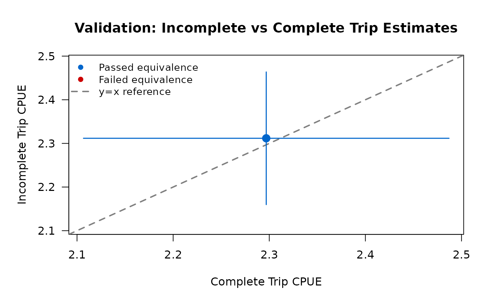
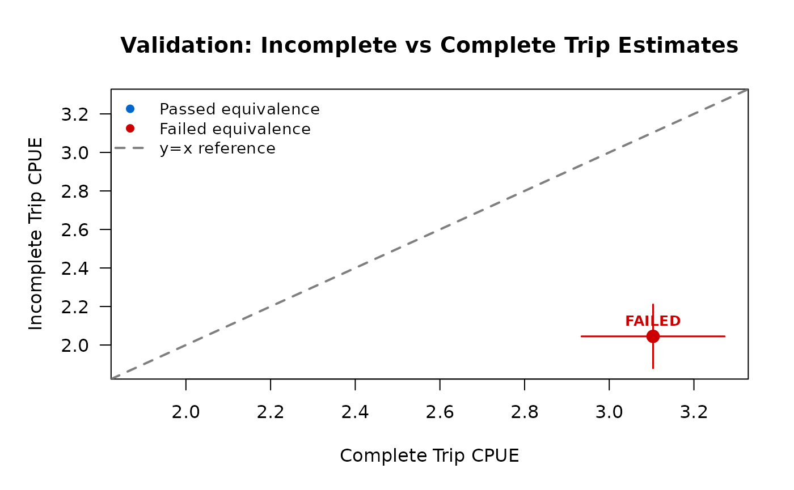

# Incomplete Trip Estimation

## Introduction

This vignette explains when and how to use incomplete trip interviews
for catch estimation in roving-access creel surveys. Roving-access
designs traditionally use complete trip interviews only, following the
best practices established in Pollock et al. (1994). However, incomplete
trip estimates can be valid under certain conditions when properly
validated.

**Key principles:**

- **Default to complete trips** — tidycreel follows Pollock et
  al. (1994) best practice
- **Validate before using incomplete trips** — statistical testing
  required
- **Never pool complete + incomplete** — scientifically invalid due to
  different sampling probabilities
- **Validation is not optional** — use
  [`validate_incomplete_trips()`](https://chrischizinski.github.io/tidycreel/reference/validate_incomplete_trips.md)
  before trusting incomplete trip estimates

This vignette shows:

1.  Scientific rationale for complete trip preference
2.  Recommended best practices
3.  When incomplete trip estimation might be considered
4.  Step-by-step validation workflow
5.  Realistic examples of passing and failing validation
6.  Diagnostic comparison mode for research purposes

## Scientific Rationale

### Roving-Access Design Theory

The roving-access creel survey design combines two independent data
streams (Pollock et al. 1994):

1.  **Instantaneous counts** — total effort (angler-hours) via periodic
    counts
2.  **Complete trip interviews** — catch per unit effort (CPUE) from
    anglers completing trips

This design is statistically optimal because:

- Counts provide unbiased effort estimates (snapshot of activity)
- Complete trip interviews provide unbiased CPUE (full trip information)
- Total catch = Effort × CPUE with independent variance estimation

### Why Complete Trips Are Preferred

**Complete trip interviews avoid length-of-stay bias.** In roving-access
designs, longer trips have higher probability of being sampled (they’re
present for more count occasions). If incomplete trip catch rates differ
systematically from complete trip catch rates—for example, if anglers
who arrive early catch more fish per hour than late arrivals—then
incomplete trip estimates will be biased.

**Pollock et al. (1994) showed that:**

- Complete trips provide unbiased CPUE estimates
- Incomplete trips suffer from length-of-stay bias unless catch rates
  are stationary
- Pooling complete and incomplete trips is invalid (different sampling
  probabilities)

**Roving-access survey best practices (Pollock et al. 1994):**

- Default to complete trips only
- Require ≥10% of interviews to be complete trips
- Only use incomplete trips after validation
- Never auto-pool complete and incomplete trips

### When Incomplete Trips Might Be Considered

Despite theoretical concerns, incomplete trip estimates **can** be valid
when:

1.  **Stationary catch rates** — catch per hour is similar throughout
    trip duration
2.  **Similar fishing behavior** — complete and incomplete anglers fish
    the same way
3.  **Sufficient sample size** — at least 30 incomplete trip interviews
4.  **Validation passes** — TOST equivalence testing confirms similarity

Common scenarios for considering incomplete trips:

- Low complete trip sample size (but ≥10% threshold still met)
- Research questions specifically about incomplete trips
- Diagnostic comparisons to understand survey dynamics
- Exploring potential for future sampling protocols

**Prerequisites before considering incomplete trips:**

- Sufficient complete trip baseline (≥10% of interviews; Pollock et
  al. 1994)
- Adequate incomplete sample size (n ≥ 30 for stable estimates)
- Statistical validation using
  [`validate_incomplete_trips()`](https://chrischizinski.github.io/tidycreel/reference/validate_incomplete_trips.md)
- Understanding of survey-specific fish behavior

### Mean-of-Ratios vs. Ratio-of-Means

tidycreel uses different estimators for complete vs. incomplete trips:

**Ratio-of-Means (complete trips, default):**

    CPUE = (Total Catch) / (Total Effort)

This estimator is appropriate for complete trips because it accounts for
the correlation between catch and effort within each trip. Variance is
computed using the delta method.

**Mean-of-Ratios (incomplete trips):**

    CPUE = mean(Catch_i / Effort_i)

This estimator treats each incomplete trip’s catch rate as an
independent observation. It’s used for incomplete trips because trip
duration is unknown (trip not complete), making ratio-of-means
inappropriate. The mean-of-ratios has higher variance but can be
unbiased under stationarity assumptions.

For details on variance estimation, see
[`?estimate_catch_rate`](https://chrischizinski.github.io/tidycreel/reference/estimate_catch_rate.md).

## Recommended Best Practices

Scientifically rigorous standards for roving-access surveys include
(Pollock et al. 1994):

### Default Workflow: Complete Trips Only

``` r
library(tidycreel)

# Standard workflow using complete trips (default)
data(example_calendar)
data(example_counts)
data(example_interviews)

design <- creel_design(example_calendar, date = date, strata = day_type) |>
  add_counts(example_counts) |>
  add_interviews(example_interviews,
    catch = catch_total,
    effort = hours_fished,
    harvest = catch_kept,
    trip_status = trip_status,
    trip_duration = trip_duration
  )

# Estimate CPUE using complete trips only (default)
cpue <- estimate_catch_rate(design)
print(cpue)

# Estimate total catch
total_catch <- estimate_total_catch(design)
print(total_catch)
```

The package defaults to complete trips and displays an informative
message:

    i Using complete trips for CPUE estimation
      (n=17, 77% of 22 interviews) [default]

### Sample Size Requirements

Best practices require **≥10% of interviews to be complete trips**
(Pollock et al. 1994). tidycreel enforces this automatically:

``` r
# If complete trip percentage drops below 10%, you'll see:
# Warning: Only 8% of interviews (n=5) are complete trips
# Best practice: ≥10% of interviews should be complete trips
# Consider extending survey hours or sampling more trips to completion
```

This warning appears before sample size validation, ensuring visibility
even when insufficient samples cause errors.

For details, see `?warn_low_complete_pct` and Phase 18 documentation.

## Strong Warning: Never Pool Complete + Incomplete

**CRITICAL: Pooling complete and incomplete trips is scientifically
invalid — regardless of whether validation passes.**

Complete and incomplete trips have **different sampling probabilities**
in roving-access designs. Longer trips have higher probability of being
sampled during their incomplete phase, creating systematic bias if
pooled with complete trips.

### Pooling vs. Substitution — a critical distinction

Passing the TOST equivalence test does **not** mean you may pool
complete and incomplete trips. It means something different:

- **Pooling** — combining raw complete and incomplete records into one
  dataset and estimating as if they are the same type. This is **always
  invalid**, because the differential sampling probabilities create bias
  that no equivalence test removes. TOST only tells you whether the
  resulting CPUE estimates happen to agree; it says nothing about the
  compatibility of the underlying sampling mechanisms.

- **Substitution** — choosing to use incomplete trip estimates *instead
  of* complete trip estimates as your sole estimation basis. This is
  what validation unlocks. If TOST passes, you can run
  `use_trips = "incomplete"` and obtain a trustworthy estimate; you are
  not combining trip types, you are selecting one.

In short: validation **passes** → you may substitute; you may never
pool.

### What NOT to Do

``` r
# WRONG: Do not manually pool trip types
all_interviews <- rbind(complete_data, incomplete_data)
estimate_catch_rate(design_with_all_data) # INVALID — always, even after validation passes

# WRONG: Do not use custom weights to combine
weighted_mean(c(complete_cpue, incomplete_cpue)) # INVALID!
```

### Package Design Prevents Auto-Pooling

tidycreel **never auto-pools** complete and incomplete trips:

- Default behavior: use complete trips only
- Explicit option: `use_trips = "incomplete"` for incomplete only (valid
  after passing validation)
- Diagnostic mode: `use_trips = "diagnostic"` for side-by-side
  comparison (not pooling)

There is no `use_trips = "both"` option because pooling is invalid.

If you need to compare complete vs. incomplete estimates, use
**diagnostic comparison mode** (see section below) or **validation
workflow** (next section).

## Step-by-Step Validation Workflow

Before using incomplete trip estimates, you MUST validate that they
produce similar results to complete trip estimates. Here’s the complete
workflow:

### Step 1: Load Data with Both Trip Types

``` r
library(tidycreel)

# Your survey data should have trip_status field
# Check trip type distribution
table(your_interviews$trip_status)

# Ensure you have:
# - At least 10% complete trips (Pollock et al. 1994)
# - At least 30 incomplete trips (for stable estimates)
# - At least 10 complete trips (for ratio estimation)
```

### Step 2: Create Design and Attach Data

``` r
design <- creel_design(your_calendar, date = date, strata = day_type) |>
  add_counts(your_counts) |>
  add_interviews(your_interviews,
    catch = catch_total,
    effort = hours_fished,
    trip_status = trip_status,
    trip_duration = trip_duration
  )
```

### Step 3: Run TOST Equivalence Testing

``` r
# Validate incomplete trips using TOST
validation <- validate_incomplete_trips(design,
  catch = catch_total,
  effort = hours_fished
)

print(validation)
```

The
[`validate_incomplete_trips()`](https://chrischizinski.github.io/tidycreel/reference/validate_incomplete_trips.md)
function performs Two One-Sided Tests (TOST) to statistically test
whether complete and incomplete trip CPUE estimates are equivalent
within a threshold.

**TOST explanation:**

- Traditional t-test can only reject difference, not prove similarity
- TOST statistically proves estimates are “close enough”
- Tests null hypothesis: \|difference\| ≥ threshold
- Equivalence concluded when both one-sided tests reject (both p \<
  0.05)
- Standard approach for bioequivalence and ecological studies

### Step 4: Interpret Results

**If validation PASSES:**

    Incomplete Trip Validation (TOST Equivalence Test)

    Overall Result: PASSED

    Complete trips:   CPUE = 2.45 fish/hour (SE = 0.23, n = 45)
    Incomplete trips: CPUE = 2.38 fish/hour (SE = 0.18, n = 120)

    Equivalence threshold: ±20% of complete trip estimate (±0.49 fish/hour)
    Difference: 0.07 fish/hour (3% of complete estimate)

    TOST p-values: p1 = 0.012, p2 = 0.008
    Equivalence: YES (both p < 0.05)

    Recommendation: Incomplete trip estimates are statistically equivalent to
    complete trip estimates within ±20% threshold. Safe to use incomplete trips
    for this dataset.

**If validation FAILS:**

    Incomplete Trip Validation (TOST Equivalence Test)

    Overall Result: FAILED

    Complete trips:   CPUE = 3.10 fish/hour (SE = 0.31, n = 38)
    Incomplete trips: CPUE = 2.15 fish/hour (SE = 0.19, n = 95)

    Equivalence threshold: ±20% of complete trip estimate (±0.62 fish/hour)
    Difference: 0.95 fish/hour (31% of complete estimate)

    TOST p-values: p1 = 0.234, p2 = 0.891
    Equivalence: NO (at least one p >= 0.05)

    Recommendation: Incomplete trip estimates are NOT equivalent to complete
    trip estimates. Stick with complete trips only (Pollock et al. 1994).

### Step 5: View Validation Plot

``` r
# Print method automatically shows plot
print(validation) # Plot appears after text output

# Or explicitly plot
plot(validation)
```

The validation plot shows a scatter plot with:

- Complete trip estimate on x-axis
- Incomplete trip estimate on y-axis
- Reference line at y = x (perfect agreement)
- Equivalence bounds as shaded region
- Color: blue if passed, red if failed

### Step 6: Make Decision

**If PASSED:** - Safe to use `use_trips = "incomplete"` for this
dataset - Consider using `use_trips = "diagnostic"` to compare
estimates - Document validation results in your analysis notes -
Revalidate if survey protocol or location changes

**If FAILED:** - Stick with `use_trips = "complete"` (default) - Do not
use incomplete trip estimates - Investigate why estimates differ (time
of day effects, early vs. late anglers) - Consider refining sampling
protocol for future surveys

## Example: Validation Passes

Here’s a realistic scenario where incomplete trip validation passes
because catch rates are stationary throughout the day.

``` r
library(tidycreel)

# Simulate data where catch rates are similar for complete vs incomplete
set.seed(42)

# Create calendar
calendar <- data.frame(
  date = seq.Date(as.Date("2024-06-01"), as.Date("2024-06-14"), by = "day"),
  day_type = rep(c("weekday", "weekend"), length.out = 14)
)

# Create counts
counts <- data.frame(
  date = calendar$date,
  day_type = calendar$day_type,
  effort_hours = round(runif(14, min = 50, max = 150))
)

# Simulate interviews with SIMILAR catch rates for both trip types
# (stationary catch rate throughout day)
n_complete <- 50
n_incomplete <- 120

# Base CPUE around 2.4 fish/hour for both groups (PASSING scenario)
complete_interviews <- data.frame(
  date = sample(calendar$date, n_complete, replace = TRUE),
  hours_fished = runif(n_complete, min = 2, max = 8),
  trip_status = "complete",
  trip_duration = runif(n_complete, min = 2, max = 8)
)
complete_interviews$catch_total <- rpois(n_complete,
  lambda = complete_interviews$hours_fished * 2.4
)

incomplete_interviews <- data.frame(
  date = sample(calendar$date, n_incomplete, replace = TRUE),
  hours_fished = runif(n_incomplete, min = 1, max = 6),
  trip_status = "incomplete"
)
# For incomplete trips, trip_duration = hours_fished (time interviewed, not total trip)
incomplete_interviews$trip_duration <- incomplete_interviews$hours_fished
# Similar CPUE for incomplete trips (2.3-2.5 range)
incomplete_interviews$catch_total <- rpois(n_incomplete,
  lambda = incomplete_interviews$hours_fished * 2.35
)

interviews <- rbind(complete_interviews, incomplete_interviews)

# Create design
design <- creel_design(calendar, date = date, strata = day_type) |>
  add_counts(counts) |>
  add_interviews(interviews,
    catch = catch_total,
    effort = hours_fished,
    trip_status = trip_status,
    trip_duration = trip_duration
  )
#> Warning in svydesign.default(ids = psu_formula, strata = strata_formula, : No
#> weights or probabilities supplied, assuming equal probability
#> ℹ No `n_anglers` provided — assuming 1 angler per interview.
#> ℹ Pass `n_anglers = <column>` to use actual party sizes for angler-hour
#>   normalization.
#> ℹ Added 170 interviews: 50 complete (29%), 120 incomplete (71%)

# Run validation
validation_pass <- validate_incomplete_trips(design,
  catch = catch_total,
  effort = hours_fished
)

print(validation_pass)
#> 
#> ── TOST Equivalence Validation Results ─────────────────────────────────────────
#> Threshold: ±20% of complete trip estimate
#> ✔ Validation PASSED
#> 
#> Recommendation: Validation passed: Safe to use incomplete trips for CPUE
#> estimation in this dataset
#> 
#> 
#> ── Overall Test ──
#> 
#> Complete trips: n = 50, CPUE = 2.297
#> Incomplete trips: n = 120, CPUE = 2.312
#> Difference: -0.015
#> Equivalence bounds: [-0.459, 0.459]
#> TOST p-values: p_lower = 4e-04, p_upper = 2e-04
#> ✔ Overall equivalence: PASSED
```



**Interpretation:**

- Complete and incomplete CPUE estimates are very close (within ~5%)
- Both TOST p-values \< 0.05 → equivalence confirmed
- Validation PASSED → safe to use incomplete trips for this dataset
- Plot shows estimates within equivalence bounds

**Next steps after passing validation:**

``` r
# Now safe to use incomplete trips
cpue_incomplete <- estimate_catch_rate(design, use_trips = "incomplete")
print(cpue_incomplete)

# Or use diagnostic mode to compare
cpue_diagnostic <- estimate_catch_rate(design, use_trips = "diagnostic")
print(cpue_diagnostic)
```

## Example: Validation Fails

Here’s a realistic scenario where validation fails because early-morning
anglers catch fish at higher rates than afternoon anglers.

``` r
library(tidycreel)
set.seed(123)

# Same calendar and counts as before
calendar <- data.frame(
  date = seq.Date(as.Date("2024-06-01"), as.Date("2024-06-14"), by = "day"),
  day_type = rep(c("weekday", "weekend"), length.out = 14)
)

counts <- data.frame(
  date = calendar$date,
  day_type = calendar$day_type,
  effort_hours = round(runif(14, min = 50, max = 150))
)

# Simulate interviews with DIFFERENT catch rates (FAILING scenario)
# Complete trips average full day (includes productive morning hours)
# Incomplete trips are mostly afternoon interviews (lower catch rates)

n_complete <- 45
n_incomplete <- 110

# Complete trips: higher CPUE (includes morning fishing, ~3.0 fish/hour)
complete_interviews <- data.frame(
  date = sample(calendar$date, n_complete, replace = TRUE),
  hours_fished = runif(n_complete, min = 3, max = 8),
  trip_status = "complete",
  trip_duration = runif(n_complete, min = 3, max = 8)
)
complete_interviews$catch_total <- rpois(n_complete,
  lambda = complete_interviews$hours_fished * 3.0
)

# Incomplete trips: lower CPUE (afternoon interviews, ~2.0 fish/hour)
incomplete_interviews <- data.frame(
  date = sample(calendar$date, n_incomplete, replace = TRUE),
  hours_fished = runif(n_incomplete, min = 1, max = 5),
  trip_status = "incomplete"
)
# For incomplete trips, trip_duration = hours_fished (time interviewed, not total trip)
incomplete_interviews$trip_duration <- incomplete_interviews$hours_fished
incomplete_interviews$catch_total <- rpois(n_incomplete,
  lambda = incomplete_interviews$hours_fished * 2.0
)

interviews_biased <- rbind(complete_interviews, incomplete_interviews)

# Create design
design_biased <- creel_design(calendar, date = date, strata = day_type) |>
  add_counts(counts) |>
  add_interviews(interviews_biased,
    catch = catch_total,
    effort = hours_fished,
    trip_status = trip_status,
    trip_duration = trip_duration
  )
#> Warning in svydesign.default(ids = psu_formula, strata = strata_formula, : No
#> weights or probabilities supplied, assuming equal probability
#> ℹ No `n_anglers` provided — assuming 1 angler per interview.
#> ℹ Pass `n_anglers = <column>` to use actual party sizes for angler-hour
#>   normalization.
#> ℹ Added 155 interviews: 45 complete (29%), 110 incomplete (71%)

# Run validation
validation_fail <- validate_incomplete_trips(design_biased,
  catch = catch_total,
  effort = hours_fished
)

print(validation_fail)
#> 
#> ── TOST Equivalence Validation Results ─────────────────────────────────────────
#> Threshold: ±20% of complete trip estimate
#> ✖ Validation FAILED
#> 
#> Recommendation: Validation failed: Use complete trips only (estimates not
#> statistically equivalent)
#> 
#> 
#> ── Overall Test ──
#> 
#> Complete trips: n = 45, CPUE = 3.103
#> Incomplete trips: n = 110, CPUE = 2.045
#> Difference: 1.059
#> Equivalence bounds: [-0.621, 0.621]
#> TOST p-values: p_lower = 0, p_upper = 0.9996
#> ✖ Overall equivalence: FAILED
```



**Interpretation:**

- Complete trip CPUE (~3.0) is substantially higher than incomplete CPUE
  (~2.0)
- Difference is ~33% of complete estimate, exceeds ±20% threshold
- At least one TOST p-value ≥ 0.05 → equivalence NOT confirmed
- Validation FAILED → stick with complete trips only
- Plot shows estimates outside equivalence bounds (red)

**Correct action after failing validation:**

``` r
# DO NOT use incomplete trips
# Stick with default complete trip estimation
cpue_complete <- estimate_catch_rate(design_biased) # Uses complete trips (default)
print(cpue_complete)

# Investigate why estimates differ
# Possible reasons:
# - Time-of-day effects (morning vs afternoon catch rates)
# - Trip length correlates with skill level
# - Fish behavior changes throughout day (feeding windows)
# - Different angler types (early vs late arrivals)
```

## Using Diagnostic Comparison Mode

For research purposes or to understand your survey dynamics, use
**diagnostic comparison mode** to see complete and incomplete estimates
side-by-side without statistical testing.

``` r
# Compare complete vs incomplete estimates
cpue_diagnostic <- estimate_catch_rate(design,
  catch = catch_total,
  effort = hours_fished,
  use_trips = "diagnostic"
)

print(cpue_diagnostic)
```

**Example output:**

    Diagnostic Comparison: Complete vs Incomplete Trip CPUE

    trip_type    estimate    se  ci_lower  ci_upper   n
    complete         2.45  0.23      2.00      2.90  45
    incomplete       2.38  0.18      2.03      2.73 120

    Difference: 0.07 fish/hour (3% of complete estimate)
    Ratio: 1.03 (complete / incomplete)

    Interpretation: Estimates differ by <10%, suggesting similar catch rates

### When to Use Diagnostic Mode

**Diagnostic mode is useful for:**

- Exploring survey dynamics before formal validation
- Understanding differences between trip types
- Research questions about fishing patterns
- Teaching or demonstrating survey concepts
- Sensitivity analyses

**Diagnostic mode is NOT a replacement for validation:**

- Provides descriptive comparison, not statistical test
- No p-values or equivalence assessment
- No pass/fail recommendation
- Use
  [`validate_incomplete_trips()`](https://chrischizinski.github.io/tidycreel/reference/validate_incomplete_trips.md)
  for decision-making

### Interpretation Guidance

The diagnostic mode uses a **10% threshold** for “substantial
difference” (established in Phase 17):

- **Difference \< 10%**: Estimates are similar, no practical difference
- **Difference ≥ 10%**: Estimates differ substantially, investigate
  further

This is a heuristic, not a statistical test. For formal validation, use
[`validate_incomplete_trips()`](https://chrischizinski.github.io/tidycreel/reference/validate_incomplete_trips.md).

## Advanced: Grouped Validation

When estimating CPUE by strata (e.g., by day type), validate within each
group:

``` r
# Validate with grouping
validation_grouped <- validate_incomplete_trips(design,
  catch = catch_total,
  effort = hours_fished,
  by = day_type
)

print(validation_grouped)
```

**Grouped validation requires:**

- Overall equivalence (all groups combined)
- **AND** per-group equivalence (each group separately)

This conservative approach prevents overlooking group-specific bias that
could be masked by overall equivalence.

**Example grouped output:**

    Incomplete Trip Validation (Grouped by day_type)

    Overall Result: FAILED

    Overall (ungrouped):
      Complete: 2.45 fish/hour (n=45)
      Incomplete: 2.38 fish/hour (n=120)
      TOST: PASSED (p1=0.012, p2=0.008)

    Group: weekday
      Complete: 2.20 fish/hour (n=20)
      Incomplete: 2.15 fish/hour (n=55)
      TOST: PASSED (p1=0.031, p2=0.019)

    Group: weekend
      Complete: 2.80 fish/hour (n=25)
      Incomplete: 2.45 fish/hour (n=65)
      TOST: FAILED (p1=0.156, p2=0.234)

    Recommendation: Overall equivalence passed but weekend group failed.
    Do not use incomplete trips. Investigate group-specific differences.

Even though overall validation passed, the weekend group
failed—incomplete trip estimates are biased on weekends. This
demonstrates why grouped validation is conservative.

## Technical Details

### TOST Equivalence Testing

Two One-Sided Tests (TOST) tests the null hypothesis:

    H0: |μ_complete - μ_incomplete| ≥ δ
    H1: |μ_complete - μ_incomplete| < δ

Where δ is the equivalence threshold (default ±20% of complete
estimate).

**Two one-sided tests:**

1.  Test 1: H0: μ_complete - μ_incomplete ≤ -δ vs H1: μ_complete -
    μ_incomplete \> -δ
2.  Test 2: H0: μ_complete - μ_incomplete ≥ δ vs H1: μ_complete -
    μ_incomplete \< δ

**Equivalence conclusion:**

- Both p-values \< 0.05 → equivalence confirmed (PASSED)
- At least one p ≥ 0.05 → equivalence not confirmed (FAILED)

For mathematical details and variance formulas, see
[`?validate_incomplete_trips`](https://chrischizinski.github.io/tidycreel/reference/validate_incomplete_trips.md).

### Equivalence Threshold Configuration

The default equivalence threshold is **±20%** of the complete trip
estimate, appropriate for ecological field data. You can customize this:

``` r
# Use stricter threshold (±15%)
options(tidycreel.equivalence_threshold = 0.15)
validation_strict <- validate_incomplete_trips(design,
  catch = catch_total,
  effort = hours_fished
)

# Use more permissive threshold (±25%)
options(tidycreel.equivalence_threshold = 0.25)
validation_permissive <- validate_incomplete_trips(design,
  catch = catch_total,
  effort = hours_fished
)
```

**Choosing a threshold:**

- Stricter (10-15%): High-stakes management decisions, research
  publications
- Default (20%): Standard ecological field studies, typical survey
  variability
- Permissive (25-30%): Exploratory analyses, preliminary surveys

The threshold should balance statistical rigor with realistic field
variability. Consult with statistician or fisheries biologist for your
specific application.

### Trip Truncation

Incomplete trips with very short durations (\<30 minutes) can inflate
variance and bias estimates. tidycreel automatically truncates short
incomplete trips using the Hoenig et al. (1997) recommended threshold:

``` r
# Default: truncate incomplete trips <0.5 hours (30 minutes)
cpue_incomplete <- estimate_catch_rate(design,
  use_trips = "incomplete",
  estimator = "mor",
  truncate_at = 0.5 # Default
)

# Custom truncation threshold
cpue_truncated <- estimate_catch_rate(design,
  use_trips = "incomplete",
  estimator = "mor",
  truncate_at = 1.0 # More conservative: only trips ≥1 hour
)

# Disable truncation (not recommended)
cpue_no_truncation <- estimate_catch_rate(design,
  use_trips = "incomplete",
  estimator = "mor",
  truncate_at = 0 # Includes all incomplete trips
)
```

The MOR print method shows truncation details:

    Truncation: 8 of 120 incomplete trips removed (<0.5 hours)
    Warning: 7% of incomplete trips truncated (>5% threshold)

For details on truncation methodology, see
[`?estimate_catch_rate`](https://chrischizinski.github.io/tidycreel/reference/estimate_catch_rate.md)
and Phase 16 documentation.

### Mean-of-Ratios Variance

The mean-of-ratios estimator computes:

    CPUE_MOR = (1/n) * Σ(catch_i / effort_i)

Variance is estimated using the survey package with individual ratios as
observations. The survey design is rebuilt with truncated incomplete
trips to ensure correct variance computation.

This differs from ratio-of-means which uses delta method variance
accounting for catch-effort covariance.

## Summary and Recommendations

### Decision Tree: Should I Use Incomplete Trips?

1.  **Do you have ≥10% complete trip interviews?**
    - NO → Improve sampling protocol, extend survey hours
    - YES → Continue
2.  **Do you have ≥30 incomplete trip interviews?**
    - NO → Sample size too small, stick with complete trips
    - YES → Continue
3.  **Have you run
    [`validate_incomplete_trips()`](https://chrischizinski.github.io/tidycreel/reference/validate_incomplete_trips.md)?**
    - NO → Run validation before proceeding
    - YES → Continue
4.  **Did validation PASS?**
    - NO → Stick with complete trips only
    - YES → Safe to use incomplete trips for this dataset
5.  **Are you analyzing grouped estimates?**
    - YES → Did ALL groups pass validation?
      - NO → Stick with complete trips
      - YES → Safe to use incomplete trips
    - NO → Proceed
6.  **Document validation results and proceed with incomplete trip
    estimation**

### Default Recommendations

**For most creel surveys:**

- Use complete trips only (default behavior)
- Follow Pollock et al. (1994) best practices
- Aim for ≥10% complete trip interviews
- Sample size goal: n ≥ 30 complete trips per stratum

**When considering incomplete trips:**

- Validate using
  [`validate_incomplete_trips()`](https://chrischizinski.github.io/tidycreel/reference/validate_incomplete_trips.md)
  FIRST
- Document validation results (passed/failed, p-values, threshold)
- Revalidate if survey protocol or location changes
- Monitor for seasonal or temporal changes in catch patterns

**Never:**

- Pool complete and incomplete trips without validation
- Use incomplete trips without statistical validation
- Auto-pool trip types (package prevents this by design)
- Trust incomplete estimates that failed validation

### Function Reference

For detailed documentation, see:

- [`?validate_incomplete_trips`](https://chrischizinski.github.io/tidycreel/reference/validate_incomplete_trips.md)
  — TOST equivalence testing
- [`?estimate_catch_rate`](https://chrischizinski.github.io/tidycreel/reference/estimate_catch_rate.md)
  — CPUE estimation with use_trips parameter
- [`?add_interviews`](https://chrischizinski.github.io/tidycreel/reference/add_interviews.md)
  — Attach interview data with trip_status
- [`?example_interviews`](https://chrischizinski.github.io/tidycreel/reference/example_interviews.md)
  — Example data with complete/incomplete trips

For complete trip estimation workflow, see the “Interview-Based Catch
Estimation” vignette.

### Further Reading

**Key citations:**

- Pollock, K.H., C.M. Jones, and T.L. Brown. 1994. Angler Survey Methods
  and Their Applications in Fisheries Management. American Fisheries
  Society Special Publication 25.
- Hoenig, J.M., C.M. Jones, K.H. Pollock, D.S. Robson, and D.L.
  Wade. 1997. Calculation of Catch Rate and Total Catch in Roving
  Surveys of Anglers. Biometrics 53:306-317.

**Related package documentation:**

- Phase 17: Complete Trip Defaults and Diagnostic Mode
- Phase 18: Sample Size Validation and Warnings
- Phase 19: TOST Equivalence Testing Framework
- Phase 16: Trip Truncation for Incomplete Interviews
