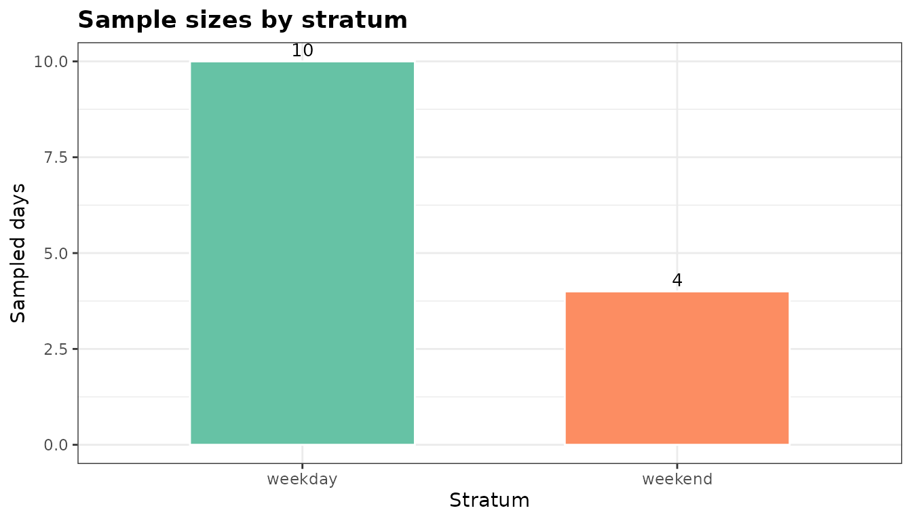
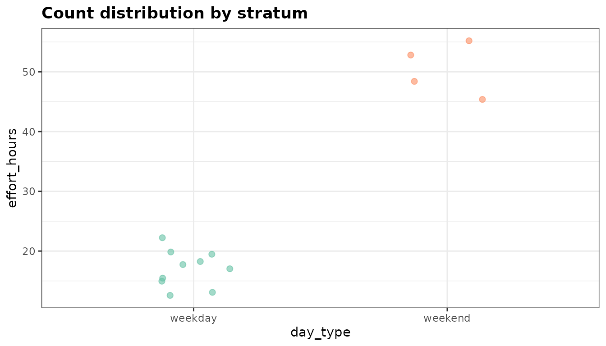
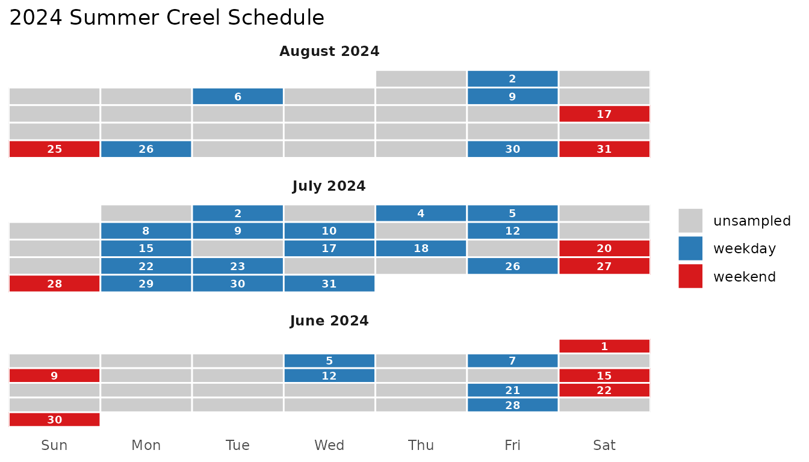
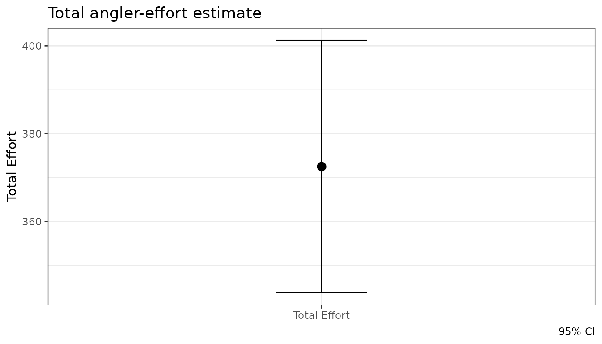
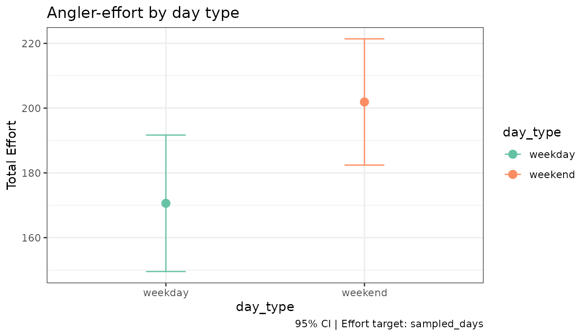
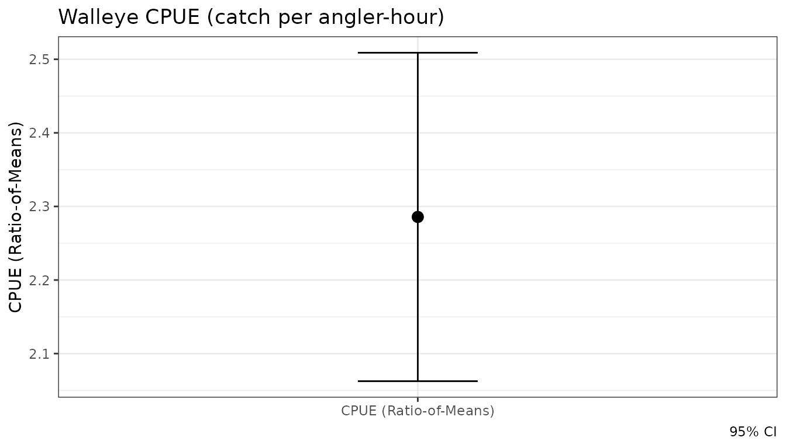
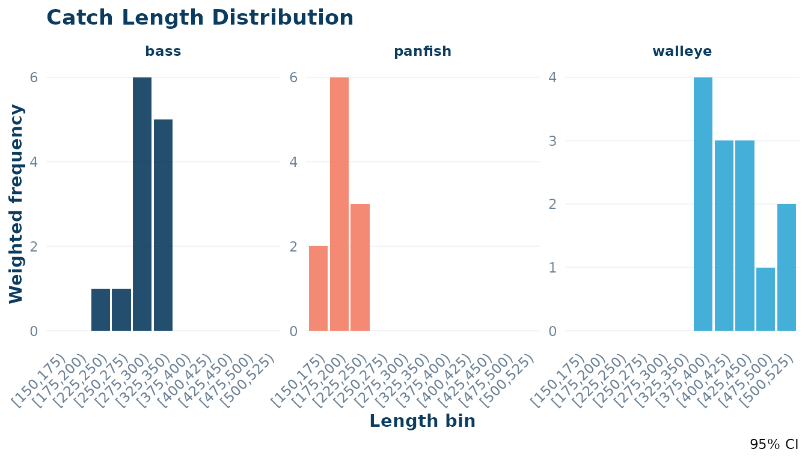
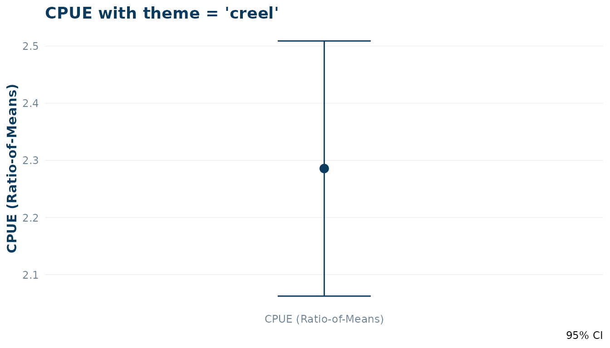
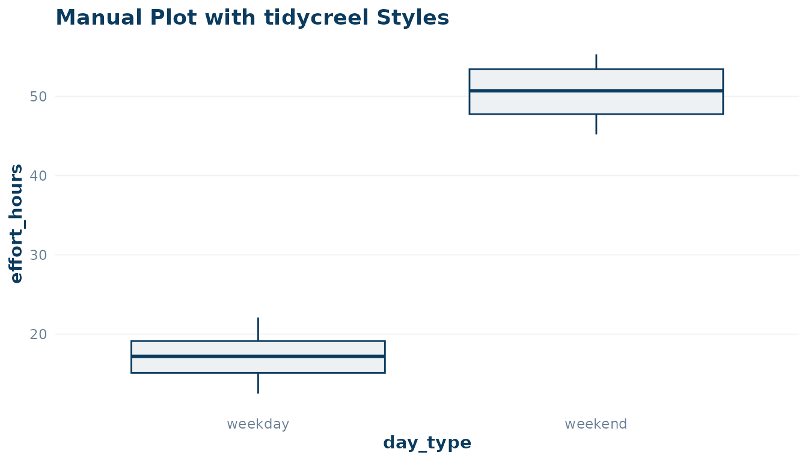

# Visualising Creel Survey Designs and Results

tidycreel ships three ggplot2-based plotting functions that cover the
main inspection points in a creel survey workflow:

| Function | When to use |
|----|----|
| [`plot_design()`](https://chrischizinski.github.io/tidycreel/reference/plot_design.md) | Inspect stratum sample sizes and count distributions |
| `autoplot(schedule)` | Review the survey calendar tile-by-tile |
| `autoplot(estimates)` | Visualise effort or CPUE estimates with CIs |
| `autoplot(length_dist)` | Visualise weighted length-frequency distributions |
| [`theme_creel()`](https://chrischizinski.github.io/tidycreel/reference/theme_creel.md) / [`creel_palette()`](https://chrischizinski.github.io/tidycreel/reference/creel_palette.md) | Apply consistent package-wide styling |

``` r

library(tidycreel)
library(ggplot2)
```

------------------------------------------------------------------------

## 1 Inspect the design with `plot_design()`

### Before attaching counts

Once you have built a `creel_design` object from a calendar,
[`plot_design()`](https://chrischizinski.github.io/tidycreel/reference/plot_design.md)
shows the number of sampled days per stratum.

``` r

# Build a design from the bundled example calendar
data("example_counts")
cal <- unique(example_counts[, c("date", "day_type")])
design <- creel_design(cal, date = date, strata = day_type)

plot_design(design, title = "Sample sizes by stratum")
```



The bar chart makes it immediately clear whether weekday and weekend
strata are balanced. A tall weekday bar with a short weekend bar signals
that estimates for the weekend stratum will carry higher uncertainty.

### After attaching counts

Once counts are attached,
[`plot_design()`](https://chrischizinski.github.io/tidycreel/reference/plot_design.md)
switches to a jitter + crossbar display showing the raw count
distribution per stratum.

``` r

design <- add_counts(design, example_counts)

plot_design(design, title = "Count distribution by stratum")
```



The crossbar shows the mean with a 95 % normal CI across sampled days.
Large within-stratum spread (many jittered points far from the crossbar)
suggests high day-to-day variability and the need for more sampling
days.

------------------------------------------------------------------------

## 2 Review the survey calendar with `autoplot()`

[`autoplot.creel_schedule()`](https://chrischizinski.github.io/tidycreel/reference/autoplot.creel_schedule.md)
renders a monthly tile calendar from a `creel_schedule` object — the
same object produced by
[`generate_schedule()`](https://chrischizinski.github.io/tidycreel/reference/generate_schedule.md).

``` r

# Generate a three-month schedule sampling 40 % of days
schedule <- generate_schedule(
  start_date    = "2024-06-01",
  end_date      = "2024-08-31",
  n_periods     = 2,
  sampling_rate = 0.4,
  seed          = 42
)

autoplot(schedule, title = "2024 Summer Creel Schedule")
```



Blue tiles are sampled **weekdays**; red tiles are sampled **weekends**;
grey tiles are unsampled days. Month panels stack vertically so the full
season is visible at a glance.

------------------------------------------------------------------------

## 3 Visualise estimates with `autoplot()`

[`autoplot()`](https://ggplot2.tidyverse.org/reference/autoplot.html)
draws point-and-errorbar plots from `creel_estimates` objects and
histogram-style bar charts from `creel_length_distribution` objects.

### Ungrouped effort estimate

``` r

data("example_interviews")

design <- add_interviews(
  design,
  example_interviews,
  catch       = catch_total,
  effort      = hours_fished,
  trip_status = trip_status
)
#> ℹ No `n_anglers` provided — assuming 1 angler per interview.
#> ℹ Pass `n_anglers = <column>` to use actual party sizes for angler-hour
#>   normalization.
#> ℹ Added 22 interviews: 17 complete (77%), 5 incomplete (23%)

effort <- estimate_effort(design)

autoplot(effort, title = "Total angler-effort estimate")
```



### Grouped effort estimate

Passing `by = day_type` estimates effort separately for each stratum.
The resulting plot maps the grouping variable to both the x-axis and
point colour.

``` r

effort_by_type <- estimate_effort(design, by = day_type)

autoplot(effort_by_type, title = "Angler-effort by day type")
```



Weekend effort is substantially higher than weekday effort — a typical
pattern in summer recreational fisheries.

### CPUE estimate

``` r

cpue <- estimate_catch_rate(design)
#> ℹ Using complete trips for CPUE estimation
#>   (n=17, 77.3% of 22 interviews) [default]

autoplot(cpue, title = "Walleye CPUE (catch per angler-hour)")
```



### Weighted Length Distributions

[`est_length_distribution()`](https://chrischizinski.github.io/tidycreel/reference/est_length_distribution.md)
produces weighted estimates of the population length frequency.
[`autoplot()`](https://ggplot2.tidyverse.org/reference/autoplot.html)
renders this as a histogram-style bar chart.

``` r

data("example_lengths")

design <- add_lengths(
  design,
  example_lengths,
  length_uid    = interview_id,
  interview_uid = interview_id,
  species       = species,
  length        = length,
  length_type   = length_type,
  count         = count,
  release_format = "binned"
)

ld <- est_length_distribution(design, by = species, bin_width = 25)

autoplot(ld, theme = "creel")
```



------------------------------------------------------------------------

## 4 Combining plots

All three functions return standard `ggplot` objects, so they compose
naturally with `+` (ggplot2 operators) or side-by-side using
[patchwork](https://patchwork.data-imaginist.com/) if that package is
installed.

``` r

# Requires patchwork
library(patchwork)
plot_design(design) + autoplot(effort)
```

------------------------------------------------------------------------

## 5 Customising Appearance with `theme_creel()`

`tidycreel` provides a built-in theme and color palette to ensure your
plots match the package’s visual style. These are designed for clean,
publication-ready output.

### Using the `theme = "creel"` argument

The
[`autoplot()`](https://ggplot2.tidyverse.org/reference/autoplot.html)
methods for estimates and schedules include a `theme` argument. Setting
this to `"creel"` applies
[`theme_creel()`](https://chrischizinski.github.io/tidycreel/reference/theme_creel.md)
and uses the package’s primary colors automatically.

``` r

autoplot(cpue, theme = "creel", title = "CPUE with theme = 'creel'")
```



### Manual Customisation

You can also apply
[`theme_creel()`](https://chrischizinski.github.io/tidycreel/reference/theme_creel.md)
manually to any ggplot object, including those returned by
[`plot_design()`](https://chrischizinski.github.io/tidycreel/reference/plot_design.md).
The
[`creel_palette()`](https://chrischizinski.github.io/tidycreel/reference/creel_palette.md)
function provides access to the individual hex codes.

``` r

# Access individual colors
pal <- creel_palette()
pal[["primary"]]
#> [1] "#0b3b5e"

# Apply theme and colors manually
ggplot(example_counts, aes(x = day_type, y = effort_hours)) +
  geom_boxplot(fill = pal[["light"]], color = pal[["primary"]]) +
  theme_creel() +
  labs(title = "Manual Plot with tidycreel Styles")
```



------------------------------------------------------------------------

## Summary

| Function | Input class | Returns |
|----|----|----|
| `plot_design(design)` | `creel_design` | bar chart (no counts) or jitter+crossbar (counts) |
| `autoplot(schedule)` | `creel_schedule` | monthly tile calendar |
| `autoplot(estimates)` | `creel_estimates` | point-and-errorbar plot |
| `autoplot(length_dist)` | `creel_length_distribution` | histogram-style bar chart |
| [`theme_creel()`](https://chrischizinski.github.io/tidycreel/reference/theme_creel.md) | N/A | ggplot2 theme object |
| [`creel_palette()`](https://chrischizinski.github.io/tidycreel/reference/creel_palette.md) | N/A | named character vector of hex colors |

All plots accept a `title =` argument and return a `ggplot` object for
further customisation with standard ggplot2 `+` syntax.
